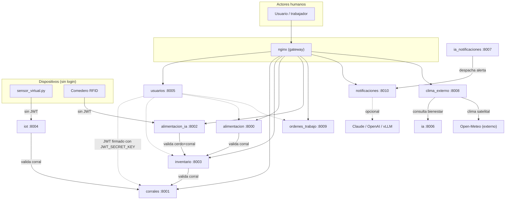
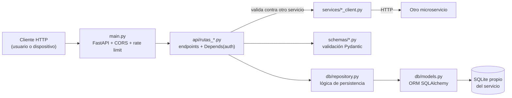
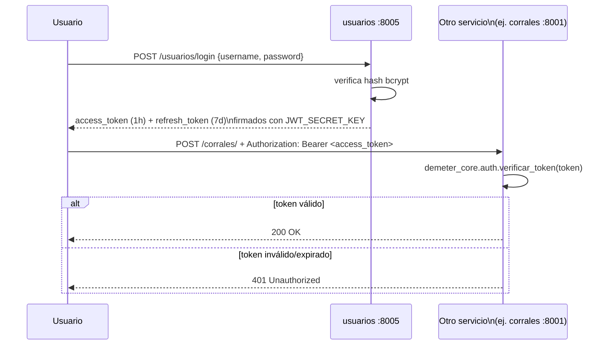

# Arquitectura de Demeter — Guía de desarrollo

Este documento explica cómo está construido el proyecto, qué hace cada microservicio, cómo se comunican entre sí, y cómo agregar un servicio nuevo siguiendo el mismo patrón. Está pensado para cualquier persona (incluido tu yo del futuro) que necesite retomar o extender el sistema sin tener que releer todo el código primero.

## 1. Qué es Demeter

Demeter es un sistema de gestión para una granja porcícola, construido como una colección de microservicios FastAPI independientes. Cada servicio es responsable de un dominio del negocio (corrales, inventario de cerdos, alimentación, sensores IoT, usuarios, notificaciones, IA) y se comunica con los demás por HTTP.

**Stack**: Python 3.13, FastAPI, SQLAlchemy + SQLite (una base de datos por servicio), Pydantic v2, `slowapi` (rate limiting), `python-jose` (JWT), `httpx`/`requests` para llamadas entre servicios, `scikit-learn`/`joblib` para los modelos de Machine Learning clásico, y un cliente propio para modelos de IA generativa (Claude/OpenAI/vLLM).

## 2. Mapa de servicios

| Puerto | Servicio | Responsabilidad |
|---|---|---|
| 8000 | `microservicio_alimentacion` | Registro **agregado por corral** de raciones de comida (lote) |
| 8001 | `microservicio_corrales` | Alta/gestión de corrales (capacidad, área, etapa productiva) |
| 8002 | `microservicio_alimentacion_ia` | Registro **individual por RFID** de comederos automáticos + predicción de dieta con IA |
| 8003 | `microservicio_inventario` | Inventario de cerdos (alta, camadas, ubicación) |
| 8004 | `microservicio_iot` | Ingesta de lecturas de sensores ambientales (temperatura/humedad) |
| 8005 | `microservicio_usuarios` | Autenticación: registro, login, JWT (access + refresh), roles |
| 8006 | `microservicio_ia` | Modelo ML clásico: predicción de estrés calórico a partir del clima |
| 8007 | `microservicio_ia_notificaciones` | Modelo ML clásico: decide si y cómo notificar (email/WhatsApp/omitir) |
| 8008 | `microservicio_clima_externo` | Clima satelital (Open-Meteo) + consulta a `microservicio_ia` + historial |
| 8009 | `microservicio_ordenes_trabajo` | Genera órdenes de trabajo (SOP) para preparar alimento manual por lote |
| 8010 | `microservicio_notificaciones` | Envío de alertas WhatsApp, con redacción opcional vía IA generativa |
| 8011 | `microservicio_ml_ws` | Servicio de reenvío/placeholder (menor madurez, no expuesto en nginx) |

`core_compartido/demeter_core` es una librería compartida (instalada en modo editable, `pip install -e core_compartido`) con código que varios servicios reutilizan: enums de dominio, esquemas Pydantic compartidos, el cliente de IA generativa, y la verificación de JWT.

## 3. Referencia funcional de cada servicio

Endpoints, reglas de negocio y modelo de datos de los 12 servicios, en orden de puerto. `🔒` = requiere `Depends(obtener_usuario_actual)` o `requiere_rol(...)`; sin candado = abierto (lectura pública, o telemetría de dispositivo).

### `microservicio_alimentacion` — :8000 — raciones por corral

| Método | Ruta | Auth | Qué hace |
|---|---|---|---|
| POST | `/alimentacion/` | 🔒 | Registra una ración entregada a un corral |
| GET | `/alimentacion/` | — | Lista registros, filtro opcional `?corral=` |
| GET | `/alimentacion/{id}` | — | Detalle de un registro |
| PATCH | `/alimentacion/{id}` | 🔒 | Corrige un registro (ej. kilos mal anotados) |
| DELETE | `/alimentacion/{id}` | 🔒 | Elimina un registro |

- **Regla de negocio**: antes de registrar o de cambiar el `corral` de un registro, valida contra `microservicio_inventario` que ese corral tenga cerdos (`GET /cerdos/?corral=`) — si la lista viene vacía, rechaza con 404.
- **Modelo** (`registros_alimentacion`): `corral`, `tipo_alimento`, `cantidad_kg`, `fecha_hora`.

### `microservicio_corrales` — :8001 — gestión de corrales

| Método | Ruta | Auth | Qué hace |
|---|---|---|---|
| POST | `/corrales/` | 🔒 | Crea un corral; calcula `area_m2 = ancho_m × largo_m` |
| GET | `/corrales/` | — | Lista todos los corrales |
| GET | `/corrales/{nombre}` | — | Busca un corral por nombre |
| PATCH | `/corrales/{id}` | 🔒 | Actualiza; recalcula el área si cambian `ancho_m`/`largo_m` |
| DELETE | `/corrales/{id}` | 🔒 | Elimina un corral |

- **Regla de negocio**: el área nunca se recibe del cliente, siempre se calcula en el servidor a partir de las medidas.
- **Modelo** (`corrales`): `nombre` (único), `capacidad_maxima`, `ancho_m`, `largo_m`, `area_m2`, `etapa` (`EtapaCorral`).

### `microservicio_alimentacion_ia` — :8002 — comedero RFID + IA nutricional

| Método | Ruta | Auth | Qué hace |
|---|---|---|---|
| POST | `/alimentacion/predecir_dieta` | — | Modelo ML (Random Forest) recomienda ración según edad/peso/temperatura |
| POST | `/alimentacion/registrar_comida` | — (telemetría) | Registra un evento de comedero: qué cerdo (RFID) comió, dónde, cuánto |
| GET | `/alimentacion/historial/{rfid}` | — | Historial de comidas de un cerdo, más reciente primero |

- **Regla de negocio**: `registrar_comida` valida contra `microservicio_inventario` que el RFID corresponda a un cerdo (`etiqueta`) realmente asignado a ese corral — rechaza con 404 si no coincide.
- **Regla de negocio**: `predecir_dieta` agrega una advertencia de "ración reducida" cuando `temperatura_c > 28` (pérdida de apetito por calor).
- **Modelo** (`registros_alimentacion`, en su propia base `alimentacion_ia.db`): `id_cerdo_rfid`, `corral`, `racion_servida_kg`, `fecha_hora`.

### `microservicio_inventario` — :8003 — inventario de cerdos

| Método | Ruta | Auth | Qué hace |
|---|---|---|---|
| POST | `/cerdos/` | 🔒 | Registra un cerdo nuevo |
| GET | `/cerdos/` | — | Lista cerdos, filtro opcional `?corral=` |
| GET | `/cerdos/{id}` | — | Detalle de un cerdo |
| PATCH | `/cerdos/{id}` | 🔒 | Actualización parcial (ej. nuevo peso) |
| DELETE | `/cerdos/{id}` | 🔒 | Elimina un cerdo |
| GET | `/cerdos/madre/{etiqueta}/lechones` | — | Lista la camada de una cerda madre |

- **Regla de negocio**: al crear un cerdo, consulta a `microservicio_corrales` los datos del corral y valida dos cosas — que la `etapa` del cerdo coincida con la etapa para la que el corral fue diseñado, y que el corral no esté al límite de `capacidad_maxima` (hacinamiento).
- **Modelo** (`cerdos`): `etiqueta` (única), `raza?`, `fecha_nacimiento`, `etapa`, `madre_etiqueta?`, `peso_kg`, `corral`.

### `microservicio_iot` — :8004 — sensores ambientales

| Método | Ruta | Auth | Qué hace |
|---|---|---|---|
| POST | `/iot/` | — (telemetría) | Recibe un "ping" de temperatura/humedad de un sensor |
| GET | `/iot/corral/{nombre}` | — | Últimas `N` lecturas de un corral (`?limite=10` por defecto), 404 si no hay ninguna |

- **Regla de negocio**: antes de guardar, valida contra `microservicio_corrales` que el corral exista.
- **Modelo** (`lecturas_iot`): `corral`, `temperatura_c`, `humedad_pct`, `fecha_hora`.
- Cliente de referencia: `sensor_virtual.py` en la raíz del repo simula un sensor real posteando cada 3s.

### `microservicio_usuarios` — :8005 — autenticación

| Método | Ruta | Auth | Qué hace |
|---|---|---|---|
| POST | `/usuarios/` | — (registro) | Crea un usuario, hashea la contraseña con bcrypt |
| POST | `/usuarios/login` | — | Verifica credenciales, emite `access_token` (1h) + `refresh_token` (7d) |
| GET | `/usuarios/` | 🔒 admin | Lista todos los usuarios (incluye `rol`) |
| POST | `/usuarios/refresh` | — (usa el refresh token como credencial) | Rota el refresh token y emite un nuevo access token |

- **Regla de negocio**: el hash del refresh token (no el token en texto plano) se guarda en la base, para poder invalidarlo/rotarlo sin exponer el valor real.
- **Modelo** (`usuarios`): `username` (único), `password_hash`, `rol` (`administrador`\|`empleado`), `activo`, `refresh_token_hash`.

### `microservicio_ia` — :8006 — predicción de estrés calórico

| Método | Ruta | Auth | Qué hace |
|---|---|---|---|
| POST | `/predecir` | — | Clasifica el riesgo de estrés calórico (0=óptimo, 1=precaución, 2=alerta) a partir de temperatura, humedad y peso promedio |

- Sin base de datos propia: modelo `.pkl` (Random Forest) cargado en memoria al arrancar. Si el archivo no existe, responde 503 en vez de fallar el arranque.

### `microservicio_ia_notificaciones` — :8007 — motor de decisión de alertas

| Método | Ruta | Auth | Qué hace |
|---|---|---|---|
| POST | `/evaluar-y-notificar` | — | Modelo ML decide: omitir, notificar por email, o WhatsApp urgente |

- **Regla de negocio**: si la decisión es "WhatsApp urgente" (código 2), despacha automáticamente `POST` a `microservicio_notificaciones:8010/notificar` con la ración calculada (`peso_promedio_kg × 0.04`) y el motivo generado por el modelo.
- Sin base de datos propia: modelo `.pkl` cargado en memoria.

### `microservicio_clima_externo` — :8008 — clima satelital + diagnóstico

| Método | Ruta | Auth | Qué hace |
|---|---|---|---|
| POST | `/clima_externo/consultar_y_guardar` | — (automatizable) | Trae clima real por GPS (Open-Meteo), consulta el bienestar a `microservicio_ia`, y guarda el historial completo |
| GET | `/clima_externo/historial/{nombre_granja}` | — | Historial de lecturas de una granja, más reciente primero |

- **Regla de negocio**: si `microservicio_ia` no responde, no rompe la respuesta — guarda el registro igual con `estado_riesgo="DESCONOCIDO"` y certeza 0.
- **Modelo** (`historial_clima_externo`): `nombre_granja`, `latitud`, `longitud`, `temperatura_c`, `humedad_pct`, `estado_riesgo`, `mensaje_ia`, `certeza_ia`, `fecha_registro`.

### `microservicio_ordenes_trabajo` — :8009 — órdenes de trabajo (SOP)

| Método | Ruta | Auth | Qué hace |
|---|---|---|---|
| POST | `/ordenes/generar` | 🔒 | Calcula la fórmula de alimento del lote según el manual operativo (SOP) y crea la orden |
| PUT | `/ordenes/completar/{codigo}` | 🔒 | El operario confirma que preparó y sirvió el lote |
| GET | `/ordenes/pendientes` | — | Lista las órdenes en estado `PENDIENTE` |

- **Regla de negocio**: la ración se reduce automáticamente por estrés calórico (`temperatura_actual_c > 22°C`), y se **corta a cero** si `peso_promedio_kg >= 110` (protocolo de pre-faena: sin sólidos ni líquidos 12–18h antes del transporte).
- **Regla de negocio**: en etapa `FINALIZACION` la receta bloquea el uso de harina de pescado (calidad de carne).
- **Modelo** (`ordenes_trabajo`): `codigo_orden` (único, autogenerado), `corral_objetivo`, `total_raciones_kg`, `receta_json`, `instrucciones_json`, `estado`, `operario_responsable?`, `fecha_creacion`, `fecha_completado?`.

### `microservicio_notificaciones` — :8010 — despacho de alertas WhatsApp

| Método | Ruta | Auth | Qué hace |
|---|---|---|---|
| POST | `/evaluar_notificacion` | — | Modelo ML propio decide si es buen momento para notificar a un trabajador |
| POST | `/notificar` | — | Despacho directo: redacta y "envía" la alerta sin volver a evaluar (usado por `ia_notificaciones`) |

- **Regla de negocio**: el texto del WhatsApp se redacta con IA generativa si `AI_MESSAGES_ENABLED=true` (ver sección 7); si está deshabilitado o la IA falla, usa siempre una plantilla fija — el envío nunca depende de un proveedor externo.
- Envío real simulado (log); ver `prueba_notificaciones.py` para un ejemplo de integración real con Twilio/Gmail.

### `microservicio_ml_ws` — :8011 — reenvío (infra, sin madurez de dominio)

| Método | Ruta | Auth | Qué hace |
|---|---|---|---|
| POST | `/send-notification` | — | Reenvía un payload `{"message": ...}` hacia `microservicio_notificaciones` |

- No tiene modelo de datos propio ni capas `db`/`schemas` desarrolladas; no está expuesto en `nginx.conf`. Tratarlo como scratch, no como referencia de patrón.

## 4. Arquitectura general y comunicación entre servicios



**Reglas de comunicación:**
- Cada servicio tiene su propia base de datos SQLite — no hay tablas compartidas. Si un servicio necesita datos de otro, lo consulta por HTTP (nunca accede a su base de datos directamente).
- Las URLs de otros servicios se leen de variables de entorno con un valor por defecto correcto (`os.getenv("CORRALES_URL", "http://127.0.0.1:8001")`), nunca hardcodeadas sin fallback.
- La autenticación JWT se aplica solo a **acciones humanas que modifican datos** (crear/editar/borrar corrales, cerdos, registros, órdenes). Los endpoints de **telemetría de dispositivo** (sensor IoT, comedero RFID) quedan sin JWT a propósito: un sensor no puede "iniciar sesión" — eso es un problema distinto (credenciales de dispositivo) que no se ha resuelto todavía. Ver sección 10.
- Las lecturas (`GET`) quedan abiertas: otros servicios las consultan para validaciones cruzadas sin credenciales de usuario.

## 5. Estructura estándar de un microservicio

Todos los microservicios nuevos deben seguir esta misma plantilla de carpetas:

```
microservicio_nuevo/
├── main.py                  # Bootstrap: FastAPI(), CORS, rate limit, router, health check
├── api/
│   ├── __init__.py
│   └── rutas_nuevo.py       # Endpoints (APIRouter), validación cruzada, Depends(auth) si aplica
├── db/
│   ├── __init__.py
│   ├── database.py          # engine, SessionLocal, get_db() — ruta anclada a __file__
│   └── models.py            # Modelos SQLAlchemy (ORM)
├── schemas/
│   ├── __init__.py
│   └── nuevo.py             # Pydantic: Create / Response / Update
└── services/                 # Solo si este servicio llama a otros
    ├── __init__.py
    └── otro_client.py        # Cliente HTTP hacia otro microservicio
```



**Capas y su responsabilidad:**
- **`main.py`**: solo bootstrap. Crea la app, registra middlewares (CORS, rate limiting), llama `Base.metadata.create_all(bind=engine)`, incluye el router, expone `GET /` como health check, y el bloque `if __name__ == "__main__"` para ejecución directa.
- **`api/rutas_*.py`**: los endpoints. Reciben el request, llaman a `services/*_client.py` para validar contra otros servicios si aplica, delegan la persistencia a `db/repository.py`, y aplican `Depends(obtener_usuario_actual)` o `Depends(requiere_rol(...))` en las rutas que modifican datos por acción humana.
- **`db/repository.py`** (cuando el servicio lo tiene): funciones puras que reciben una `Session` y hacen el CRUD. Las rutas nunca deberían hacer `db.query(...)` directamente — eso rompe la capa y ya causó una regresión real en este proyecto (ver `microservicio_alimentacion_ia` antes de la Fase 3).
- **`db/database.py`**: define `engine` con una ruta **anclada a `os.path.dirname(os.path.abspath(__file__))`**, nunca a una ruta relativa tipo `sqlite:///./algo.db` — eso depende del directorio desde el que se lance el proceso y puede colisionar con otro servicio que use el mismo nombre de archivo (nos pasó con `alimentacion.db` vs `alimentacion_ia.db`).
- **`schemas/*.py`**: `Create` (entrada), `Response` (salida, nunca incluye contraseñas/hashes), `Update` (todos los campos `Optional`, para permitir actualizaciones parciales).

**Imports**: todos los imports dentro de un servicio deben ser **relativos** (`.db`, `..schemas`, `..services`), nunca absolutos tipo `from db import models`. Mezclar ambos estilos fue la causa de que 6 de 12 servicios no arrancaran ni sus tests corrieran (Fase 0). El servicio se ejecuta siempre **desde la raíz del repositorio**:

```bash
python -m microservicio_nuevo.main
# o equivalentemente:
uvicorn microservicio_nuevo.main:app --reload
```

## 6. Autenticación (JWT)



- `microservicio_usuarios` es el único que **emite** tokens (`core/security.py`).
- `core_compartido/demeter_core/auth.py` es el único lugar que **verifica** tokens — cualquier servicio lo importa con `from demeter_core.auth import obtener_usuario_actual, requiere_rol`.
- Los dos deben compartir el mismo `JWT_SECRET_KEY` (variable de entorno). Si no se define en ningún lado, todos caen al mismo valor de desarrollo por defecto, así que funciona igual en local sin configurar nada — pero antes de un despliegue real hay que fijarlo explícitamente e idéntico en todos los servicios.
- Patrón para proteger un endpoint nuevo:

```python
from demeter_core.auth import obtener_usuario_actual, requiere_rol

@router.post("/")
def crear_algo(datos: AlgoCreate, db: Session = Depends(get_db),
               _usuario=Depends(obtener_usuario_actual)):
    ...

@router.get("/admin-only")
def listar_todo(_usuario=Depends(requiere_rol("administrador"))):
    ...
```

**Cuándo NO proteger un endpoint**: si el emisor real es un dispositivo (sensor, comedero automático) y no una persona, no le agregues `Depends(obtener_usuario_actual)` — el dispositivo no puede loguearse con este sistema. Documenta el endpoint como abierto y deja pendiente el problema de autenticación de dispositivos (credenciales/API key por dispositivo) como una decisión aparte.

## 7. Cliente de IA generativa (`demeter_core.ai_client`)

```mermaid
flowchart TD
    Alerta["Evento que necesita\nun mensaje en lenguaje natural"] --> Enabled{"AI_MESSAGES_ENABLED?"}
    Enabled -- no --> Plantilla["Plantilla fija\n(siempre disponible)"]
    Enabled -- sí --> Cliente["cliente_ia.generar_texto(prompt)"]
    Cliente --> Proveedor{"AI_PROVIDER"}
    Proveedor -- claude --> Claude["Anthropic Messages API"]
    Proveedor -- openai --> OpenAI["OpenAI Chat Completions"]
    Proveedor -- vllm --> VLLM["Servidor vLLM propio\n(API compatible con OpenAI)"]
    Claude --> Exito{"Respuesta OK?"}
    OpenAI --> Exito
    VLLM --> Exito
    Exito -- sí, tras reintentos si hiciera falta --> Texto["Texto generado"]
    Exito -- no, tras agotar reintentos --> Plantilla
```



- Un solo módulo (`ai_client.py`) soporta los tres proveedores vía HTTP puro (`httpx`), sin SDKs adicionales. `ClienteVLLM` reutiliza el formato de `ClienteOpenAI` porque vLLM expone una API compatible.
- Reintentos con backoff exponencial ante 429/5xx/timeout; si se agotan, levanta `AIClientError`.
- El cliente se crea **una sola vez** al arrancar el servicio (en el `lifespan` de FastAPI) y se reutiliza para todas las peticiones — nunca crear un `httpx.AsyncClient` por request.
- **Siempre con fallback a una plantilla fija** si la IA falla o está deshabilitada (`AI_MESSAGES_ENABLED=false` por defecto) — el envío de una alerta nunca debe depender de que un proveedor externo esté disponible.
- Ejemplo de uso real: `microservicio_notificaciones/services/whatsapp_client.py`.

## 8. Testing

Patrón establecido en `tests/`:

- **Aislamiento de base de datos**: cada test file usa SQLite en memoria (`sqlite:///:memory:` + `StaticPool`) y sobreescribe `get_db` vía `app.dependency_overrides`, para no tocar el `.db` real del servicio ni depender de datos de una corrida anterior.
- **Mocking de llamadas a otros servicios**: se mockea la función del cliente (`@patch("microservicio_x.api.rutas_x.otro_servicio_client.verificar_algo")`), nunca se depende de que el otro servicio esté realmente corriendo.
- **`tests/conftest.py`** expone `header_auth(rol=...)` para generar un JWT válido de prueba sin necesitar loguearse de verdad.
- Correr toda la suite: `pytest` desde la raíz (usa `pytest.ini`, que ya trae `asyncio_mode = auto` para tests async).

```python
# Ejemplo mínimo para un endpoint protegido
def test_crear_algo_sin_token_devuelve_401():
    respuesta = client.post("/algo/", json={...})
    assert respuesta.status_code == 401

def test_crear_algo_con_token_devuelve_200():
    respuesta = client.post("/algo/", json={...}, headers=header_auth())
    assert respuesta.status_code == 200
```

## 9. Cómo agregar un microservicio nuevo (checklist)

1. Crear la carpeta `microservicio_nuevo/` con la estructura de la sección 5 (`api/`, `db/`, `schemas/`, `services/` si aplica), cada subcarpeta con su `__init__.py`.
2. `db/database.py`: engine anclado a `__file__` (copiar el patrón de cualquier servicio existente, ej. `microservicio_iot/db/database.py`).
3. Definir los modelos ORM en `db/models.py` y los schemas Pydantic en `schemas/`.
4. Escribir las rutas en `api/rutas_nuevo.py`: importar `Depends(obtener_usuario_actual)`/`requiere_rol(...)` de `demeter_core.auth` en las mutaciones humanas; dejar sin proteger las que vengan de un dispositivo.
5. `main.py`: copiar el bootstrap de un servicio ya migrado (ej. `microservicio_corrales/main.py`) — CORS con `allow_credentials=False`, rate limiting con el patrón `app.state.limiter` + `add_exception_handler(RateLimitExceeded, ...)`, health check en `/`.
6. Elegir un puerto libre (ver tabla de la sección 2) y usarlo tanto en el `if __name__ == "__main__"` como al documentarlo aquí, y sumarlo a la referencia funcional de la sección 3.
7. Agregar la ruta correspondiente en `nginx/nginx.conf`.
8. Si necesita llamar a otro servicio, crear `services/otro_client.py` leyendo la URL de una variable de entorno con el puerto correcto como default.
9. Escribir tests en `tests/test_nuevo_service.py` siguiendo el patrón de la sección 8.
10. Agregar cualquier dependencia nueva a `requirements.txt` (y a `requirements-dev.txt` si es solo para tests).
11. Correr `pytest` completo antes de dar por terminado — no debe bajar el conteo de tests que pasan.

## 10. Deuda técnica conocida (para no repetirla ni sorprenderse)

- `microservicio_ml_ws` es un servicio placeholder/de scratch, no está en `nginx.conf` ni tiene la misma madurez que el resto.
- Los scripts `entrenar_*.py`, `prueba_*.py` dentro de `microservicio_notificaciones` y `microservicio_ia` son herramientas de desarrollo (entrenar modelos, probar integraciones reales), no parte de la app desplegable — no los importes desde `main.py`.
- La autenticación de dispositivos (sensor IoT, comedero RFID) sigue sin resolver — hoy esos endpoints están abiertos a propósito, no por descuido.
- `.github/workflows/ci.yml` no construye ni testea todos los servicios; si agregas uno nuevo, sería buen momento para arreglar eso también.
